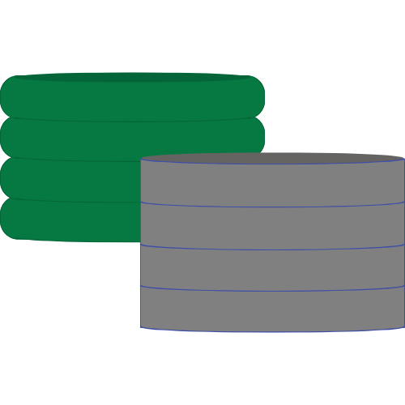

<h1 align="center">Granum Technologies LLC</h1>

  

At Granum Technologies LLC, our mission is to research and develop software solutions that address unmet needs. Our inspiration comes from the granum, a crucial component in plant cells essential for photosynthesis, symbolizing our commitment to being at the core of technological innovation.

Founded by a seasoned researcher and developer with extensive experience in both the fintech industry and scientific research, Granum Technologies seamlessly blends cutting-edge technology with holistic insights. 

  <a href="https://www.granum-tech.com/">Website</a> | 
  <a href="https://x.com/granum_tech">Twitter</a>

# Contents
- [Products](#products)
    - [creditparsepro.io](#creditparseproio)
- [Competitions](#competitions)
- [Support](#support)

## Products

### creditparsepro.io
Enable next-gen fintech innovations with creditparsepro.io: our API parses fixed-length credit reports from major US bureaus, delivering analytics and ML-ready JSON data.
- **Website**: [creditparsepro.io](https://www.creditparsepro.io/)
- **GitHub**: [/creditparsepro](https://github.com/granum-tech/creditparsepro)
- **Reddit**: [creditparsepro Reddit](https://www.reddit.com/user/creditparsepro/)
- **Postman Docs**: [creditparsepro Postman](https://documenter.getpostman.com/view/34164250/2sA3BgBFus)
- **Stripe Billing Portal**: [Stripe Billing](https://billing.stripe.com/p/login/14kaHj8NX5LJ5Ta8ww)
- **Support Email**: [info@creditparsepro.io](mailto:info@creditparsepro.io)

## Competitions

Coming soon!

## Support

For general support and queries, please contact us at [info@granumtech.com](mailto:info@granum-tech.com).
